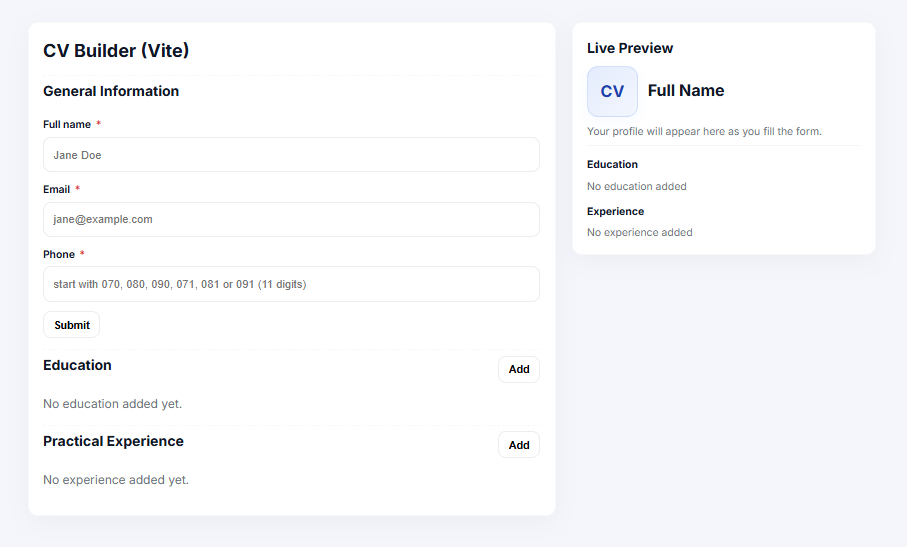

# CV Application

A simple and interactive CV/Resume generator built with **React + Vite**.  
Users can input their personal information, education, and work experience to generate a polished résumé preview in real time.

---

## ✨ Features

- Dynamic form inputs for:
  - General info (name, email, phone number)
  - Education history
  - Work experience
- Live CV preview with smooth **fade-in animation**
- Form validation:
  - Phone numbers must be exactly 11 digits starting with 080, 070, 090, 081, 071, or 091
  - All fields are required
  - Easy date selection via dropdowns
- Clean and modern design with reusable React components
- Responsive layout for desktop and mobile

---

## 📦 Tech Stack

- **React 18** (components & state management)
- **Vite** (lightning-fast dev environment)
- **CSS Modules / custom styles** (for styling and animations)

---

## 🚀 Getting Started

### Prerequisites

- [Node.js](https://nodejs.org/) v16+
- npm (comes with Node) or yarn/pnpm

### Installation

```bash
# Clone this repository
git clone https://github.com/hencci/cv-application.git

# Go into the project folder
cd cv-application

# Install dependencies
npm install
```

### Development

```bash
# Run local dev server
npm run dev
```

Visit local host in your browser

---

## 📁 Project Structure

```css
src/
  components/
    GeneralInfo.jsx
    EducationForm.jsx
    ExperienceForm.jsx
    CVPreview.jsx
    FormField.jsx
  styles/
    app.css
    education.css
    experience.css
    general.css
    preview.css
  utils/
    dateUtils.js
  App.css
  App.jsx
  index.css
  main.jsx
index.html
REASDME.md
```

---

## 🖼️ Screenshots



---

## 🤝 Contributing

Pull requests are welcome! For major changes, please open an issue first to discuss what you’d like to add or modify.

---

## 📜 License

This project is licensed under the MIT License.

---

## Live preview

https://hencci-cv-builder.netlify.app

---

## Contact

Created by [Henry Moses](https://github.com/hencci)
Feel free to reach out if you have any questions
